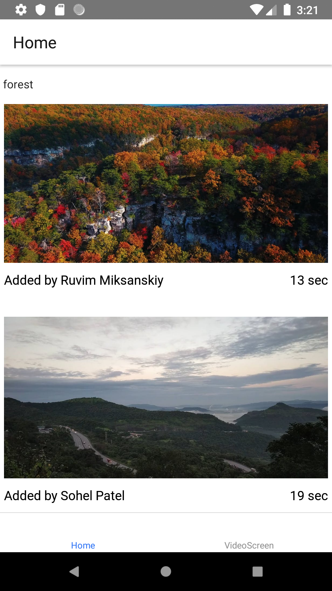

# Video Gallery ReactNative Application

## Technological Stack:
* React Native
* Redux
* ReactNativeFastImage
* ReactNativeRouterFlux
* ReactNativeVideo
## Description
Application consists from two scenes:
#
*Home scene*, where user initially can find the list of the most popular  
videos from API. The list item consists of such data:
* video duration (in sec)
* user name who added the video 
* compressed title video image
  

#
*Video scene*, on which user can be redirected onTouch list item event. 
It contains a video player in full screen width format with video
navigation buttons.

*Application navigation developed by usage of Redux and ReactNativeRouterFlux Scenes and Tabs.*

*For API resource was used Pexels.com API.*
